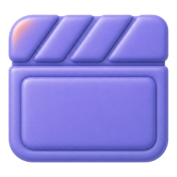

# CELEBUS MOMENT — 아이콘 A안(선별) GPT 디자이너 프롬프트

> 전체 26종을 앱에 적용하기엔 기능적 제약(상태변화·소형·다크배경·애니메이션)이 있어 **선별 적용(A안)** 으로 확정.
> 아래 프롬프트를 GPT 디자이너 에이전트에 그대로 전달하면, 3D 참이 필요한 **7종(8개 지점)** 만 제작합니다.

---

## 프롬프트 (복사해서 사용)

당신은 K-pop 팬 영상 플랫폼 **"CELEBUS MOMENT"**(밴드 V01D 전용, 모바일 PWA)의 아이콘 디자이너입니다. 이미 26종 2.5D 참(charm) 아이콘 세트를 제작했으나, 전 종을 앱에 적용하기엔 기능적 제약(상태변화·소형·다크배경·애니메이션)이 있어 **"선별 적용"** 방식으로 확정했습니다. 아래 **7종(8개 지점)** 만 3D 참으로 다듬어 주세요. 나머지 아이콘은 라인(선) 아이콘으로 유지하므로 제작하지 않아도 됩니다.

### 적용 원칙
3D 참은 **"크고 · 브랜드감이 필요하고 · 색 상태변화(활성/비활성)가 없는"** 자리에만 사용합니다. 작은 인라인·상태변화·다크배경·회전 애니메이션 자리는 라인 아이콘을 유지하므로 제작 대상이 아닙니다.

### 제작 대상 — 3D 참 7종 / 사용 지점 8개

| # | 아이콘 키 | 사용 지점 | 크기·용도 |
|---|-----------|-----------|-----------|
| 1 | `log-in` | 마이 · 비로그인 안내 | 48px 빈 상태 일러스트 |
| 2 | `bell` | 알림 · 빈 상태 | 40px 빈 상태 일러스트 |
| 3 | `image-off` | 썸네일 없는 영상 카드 | 32px placeholder |
| 4 | `clapperboard` | 커버 없는 아카이브 | 32px placeholder |
| 5 | `upload` | 온보딩 '영상 올리기' | 24px 스텝 강조 |
| 6 | `heart` | 온보딩 '멤버가 봐줘요' | 24px 스텝 강조 (※ 정적 심볼용. 좋아요 버튼의 채움/활성 상태는 별도 라인 아이콘이 담당하므로 상태 페어 불필요) |
| 7 | `trophy` | 온보딩 '주목·보상' + 토너먼트/명예 헤더 | 24px + 20px (2개 지점 공용) |

### 비주얼 요건
- **스타일**: 기존 26종 참 세트와 완전히 동일한 톤·재질·라이팅·모서리 처리로 일관성 유지
- **브랜드 컬러**: CELEBUS Violet `#6C4DE6` (주), CELEBUS Coral `#FF7A6A` (보조 포인트)
- **배경**: 완전 투명(RGBA)
- **캔버스**: 256×256px, 사방 약 12px 안전 여백
- **가독성**: 20~48px로 축소해도 형태가 또렷하고 무겁지 않게 — 디테일 과밀 금지, 실루엣 명확
- 텍스트/워드마크 금지, 픽토그램만
- 라이트/다크 배경 양쪽에서 판별 가능한 명도 대비

### 산출물
- 아이콘당 **256×256 RGBA PNG** (투명 배경)
- 7종 한 세트로 스타일 통일, 파일명은 위 영문 키 사용
  - `log-in.png`, `bell.png`, `image-off.png`, `clapperboard.png`, `upload.png`, `heart.png`, `trophy.png`

### 확인 요청
- PNG 참 아이콘의 **최소 사용 크기**를 몇 px로 권장하는지 (현재 ≥24px 가정)
- 위 7종 외 추가로 참이 필요하다고 판단되는 지점이 있는지

---

## 3D 작업 대상 7종 — 현재 아이콘 미리보기 (다듬을 원본)

아래는 현재 참 PNG입니다. **이 형태·의미를 유지**하되 위 비주얼 요건에 맞춰 다듬어 주세요. (원본 파일: `아이콘_A안_3D대상/`)

| log-in | bell | image-off | clapperboard |
|:---:|:---:|:---:|:---:|
|  |  |  |  |
| 비로그인 안내 48px | 알림 빈 상태 40px | 썸네일 없음 32px | 커버 없음 32px |

| upload | heart | trophy |
|:---:|:---:|:---:|
|  |  |  |
| 온보딩 올리기 24px | 온보딩 하트 24px | 온보딩/토너먼트 24·20px |

---

## 참고 — 라인 아이콘 유지 (제작 대상 아님)

작은 인라인 · 상태변화 · UI 크롬 · 다크배경 · 애니메이션 자리는 기존 라인(`currentColor`) 아이콘을 유지합니다.

`heart`(좋아요·멤버하트 — 채움/활성 상태) · `eye`(조회수) · `message-circle`(댓글) · `flag`(신고) · `share-2`(다크배경 공유) · `external-link`(원본) · `check`(배지·투표 확정) · `calendar-days` · `chevron-left` · `x` · `globe` · `link-2` · `loader-2`(회전) · `alert-circle`(danger 빨강) · `refresh-cw` · `trash-2` · `corner-down-right` · `plus`

## 첨부 권장
스타일 일관성을 위해 아래를 함께 전달하면 좋습니다.
- 기존 26종 참 미리보기: `docs/design-review/아이콘_명세.html`
- 참 PNG 원본: `src/img/celebus-moment-icons-package/png-256/`
- 팔레트: Violet `#6C4DE6` / Coral `#FF7A6A`
